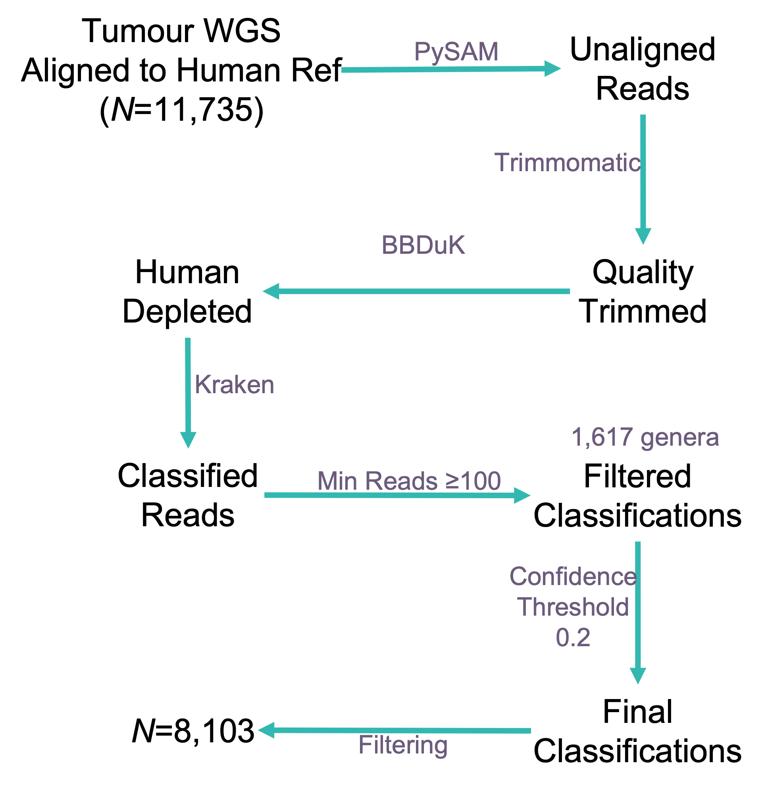
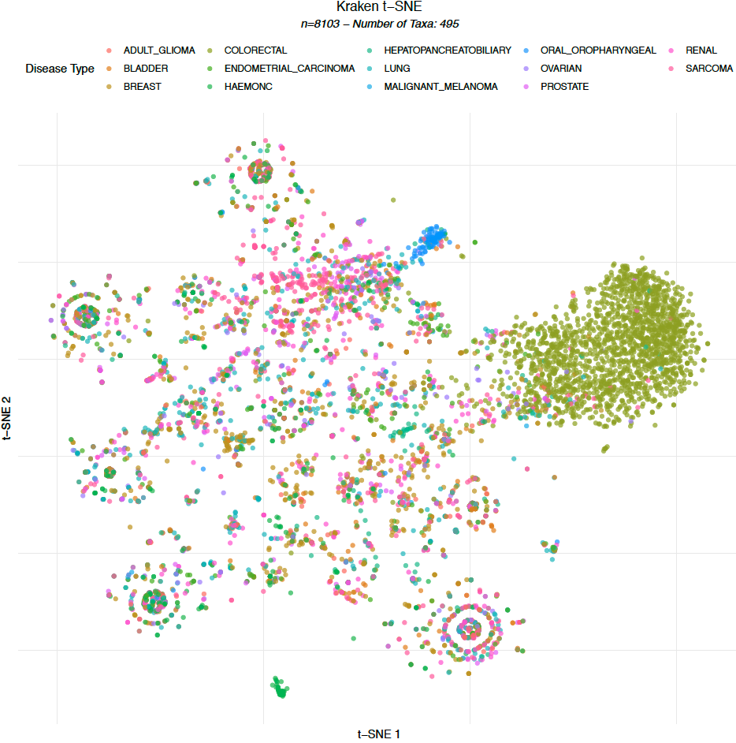
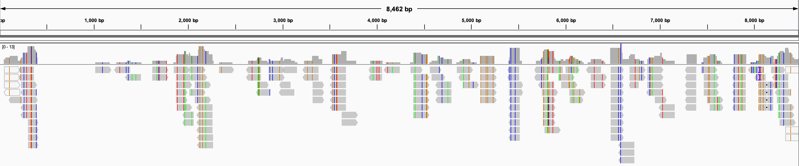

```{r, include=FALSE}
knitr::opts_chunk$set(echo = FALSE,
                      warning = FALSE,
                      tidy = FALSE,
                      message = FALSE,
                      fig.align = 'center',
                      out.width = "100%")
options(knitr.table.format = "html") 
#load/install required libraries

list.of.packages <- c('tidyverse','posterdown','ggpubr', 'devtools', 'kableExtra', 'emo')
new.packages <- list.of.packages[!(list.of.packages %in% installed.packages()[,"Package"])]
if(length(new.packages)) {
 stop('Some packages not installed. please run Rscript install.R')
}

#list.of.packages <- c('tidyverse','posterdown','ggpubr', 'devtools', 'kableExtra')
#new.packages <- list.of.packages[!(list.of.packages %in% installed.packages()[,"Package"])]
#if(length(new.packages)) install.packages(new.packages)

library(posterdown)
library(tidyverse)
library(ggpubr)
library(devtools)
library(kableExtra)

#new.packages <- !(c('emo') %in% installed.packages()[,"Package"])
#if(length(new.packages)) devtools::install_github("hadley/emo")

#load packages required with devtools
library(emo)

#read in required data for plots later


#data frame for contaminant, importance and whether evidence was found in published literature (eisenhofer et al. 2019)
contaminant_rankings <- data.frame( Genus = c("Enterococcus", "Curvibacter", "Methylobacterium", "Sphingomonas", "Variovorax", "Actinomyces", "Bradyrhizobium", "Burkholderia", "Cutibacterium", "Hammondia", "Kocuria", "Micrococcus", "Ralstonia", "Sphingobium", "Streptococcus"),
                                    contaminant_ranking = c(1,2,3,4,5,6,7,8,9,10,11,12,13,14,15),
                                    Literature = c("&#x2705;", "&#x2705;", "&#x2705;","&#x2705;",
                                                   " ",
                                                   "&#x2705;", "&#x2705;","&#x2705;",
                                                   " "," "," "," ","&#x2705;","&#x2705;", "&#x2705;"))


```

# Background

Microbial infections cause 15% of cancers globally [@RN102]. The most significant oncomicrobes are _Helicobacter pylori_ that causes gastric carcinoma [@RN102] and Human papillomavirus (HPV) that causes several types of cancer. HPV vaccination has been successful in preventing infection and tumourigenesis worldwide[@RN138]. As we transition into an era of genomic medicine, it is becoming increasingly possible to characterise the tumour-microbe landscape by interrogating high-throughput cancer sequencing data. We have developed a benchmarked approach to report evidence for microbial constituents found within human tissue samples ([SEPATH](https://github.com/UEA-Cancer-Genetics-Lab/sepath_tool_UEA) [@RN454]). This pipeline has been applied to cancer sequences within Genomics England's 100,000 Genomes Project. A wide range of microbial taxa are detected and here we report on the potential translational opportunities that tumour-microbial data offers.


# Methods

```{r, methodsflow, fig.cap="SEPATH was applied to tumour whole genome sequences (WGS, _N_=11,735) from Genomics England's 100,000 Genomes Project. This pipeline extracts high quality reads that are unaligned to the human genome, runs additional human read removal and they are subject to taxonomic classification. A total of 1,617 microbial genera were detected in the cohort. The final matrix was filtered to retain dominant tumour types that were PCR Free, from fresh-frozen, primary tisue (_n_=8,909)"}

```

<br>

#### Pan-Cancer Structure

A feature selection algorithm ([Boruta](https://cran.r-project.org/web/packages/Boruta/Boruta.pdf)) identified microbial genera (495) most indicative of tumour type. A distance matrix was constructed using the Spearman's distance with the `distanceMatrix` function ([ClassDiscovery](https://cran.r-project.org/web/packages/ClassDiscovery/index.html) package). The distance matrix was subject to *t*-SNE ([Rtsne](https://cran.r-project.org/web/packages/Rtsne/Rtsne.pdf) package) with parameters: `dims=2, perplexity=80, max_iter=2000, check_duplicates=TRUE.`

<br>

#### Mutation Calling

Somatic variant VCF files were generated by Genomics England. Non-synonymous *TP53* variants of moderate-high impact were investigated in the oral/oropharyngeal cohort. Samples with no variants were considered wild-type.

<br> 

#### HTLV-1 Identification

Deltaretrovirus sequencing reads from one participant were extracted from both tumour and germline samples and were subject to a Megablast search (nr/nt collection). Reads were aligned to a HTLV-1 reference [NC_001436.1](https://www.ncbi.nlm.nih.gov/assembly/GCF_000863585.1/) using BWA-MEM with default parameters [@Li2009]. The resulting alignment was viewed with [IGV](https://igv.org/) (version 2.9.4) [@Robinson2011].


<br>

# Results

#### Pan-Cancer Structure

Oral and colorectal tumours contain distinctive microbial elements compared to other cancer types (fig. \@ref(fig:tsnefig)).

```{r, tsnefig, fig.cap='*t*-SNE plot demonstrating microbial structure for *n*=8,103 tumour samples that were subject to whole genome sequencing. Oral and Colorectal cancers typically contain microbial elements that distinguish them from other tumour types.'}

```

<br>

#### Alphapapillomavirus

Detection of Alphapapillomavirus overlaps with diagnostic tests for HPV and aligns with somatic *TP53* mutational status (fig. \@ref(fig:hpvfig)). 24/38 HPV$^{-}$ tumours contain non-synonymous *TP53* variants. All 10 HPV$^{+}$ tumours have wild-type *TP53* as expected [@Shi2021]. Alphapapillomavirus was detectable in both primary as well as metastatic tumour samples.


```{r, hpvfig, fig.cap='Alphapapillomavirus detection in Oral Cancer with *TP53* mutational status.'}
knitr::include_graphics("plots/hpv_tp53.png")
```


#### HTLV-1 Detection

We found evidence for Deltaretrovirus in one participant. A similar result was observed in the participant's germline sample. Classified reads were extracted and uniquely matched HTLV-1 upon a [BLAST](https://blast.ncbi.nlm.nih.gov/Blast.cgi) search. Furthermore, the classified sequencing reads align along the length of a HTLV-1 reference genome providing additional evidence for detection (fig. \@ref(fig:htlvfig)).


```{r, htlvfig, fig.cap='Alignment of 172 sequencing reads from a participants tumour and germline samples across a HTLV-1 reference genome (8,462 base pairs).'}

```


# Conclusions

* Microbial nucleic acids are detectable within tumour whole genome sequence data.
* Colorectal and oral cancers typically contain distinctive microbial elements.
* Detection of HPV is comparable to the clinical standard. This may provide insights into 101 samples currently with no HPV test result, 8 of which are estimated positive.
* It might be possible to detect infectious diseases like HTLV-1 but this needs to be compared to a diagnostic standard.


# Acknowledgements

Thanks to participants, staff and to [Big C](http://www.big-c.co.uk/) for making this research possible. This research was made possible through access to the data and findings generated by the 100,000 Genomes Project; [http://www.genomicsengland.co.uk](http://www.genomicsengland.co.uk)

```{r, logos, out.width="100%"}
  
```

*Note: * This poster was produced in R. Details and code to reproduce this poster can be found: [github.com/Agihawi/gel_summit_2022](https://github.com/Agihawi/gel_summit_2022)

### References
